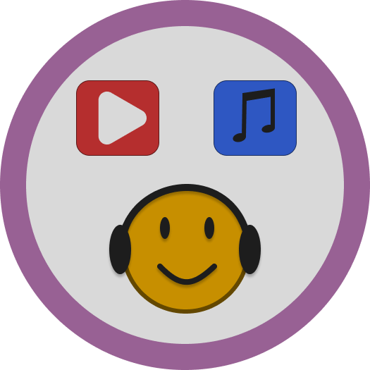

# Discord Music Bot 

<p align="center">
  

## Overview

Welcome to the repository of my first Discord music bot! This bot is built using Python and provides music playback functionality for voice channels.

## Requirements

- Python 3.7 or higher
- Install the required dependencies from `requirements.txt` using the following command:

```bash
pip install -r requirements.txt
```

## Getting the Token

To operate the bot, you'll need a Discord Bot token. Follow these steps:

1. Create a new bot on the [Discord Developer Portal](https://discord.com/developers/applications).
2. Copy the token and paste it into the `token.txt` file.

## Running the Bot

To run the bot, execute the following command:

```bash
python bot.py
```
or
```bash
start bot.bat
```

## Bot Commands

- `!play`

  Syntax: `!play <song name or link>`

  This command allows the bot to start playing music in a voice channel. You can provide either the song name or a media link.

- `!skip`

  Syntax: `!skip`

  Skips the current track and moves to the next one in the queue.

- `!stop`

  Syntax: `!stop`

  Stops the music playback and clears the queue.

<!-- Continue to add descriptions of other commands supported by your bot -->

